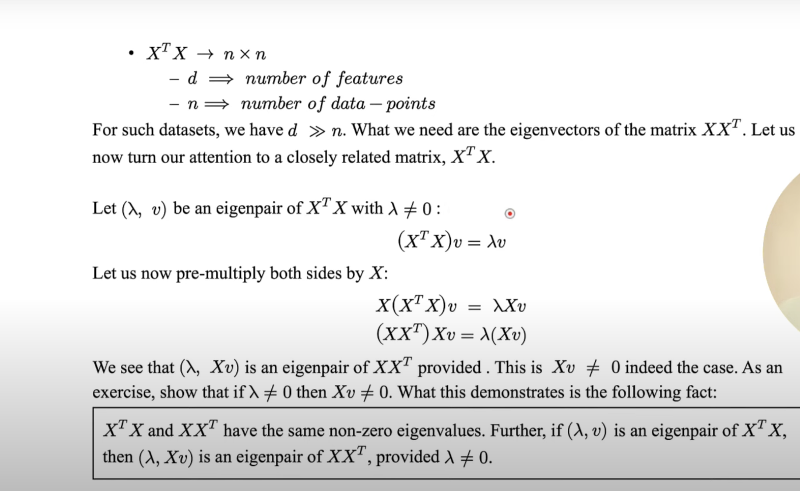
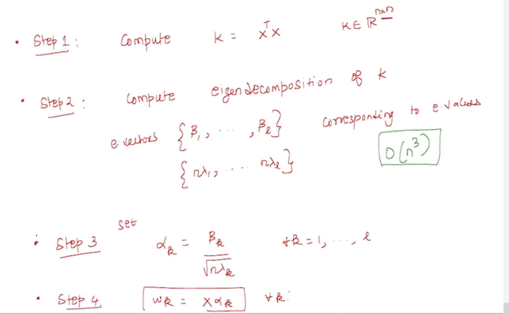
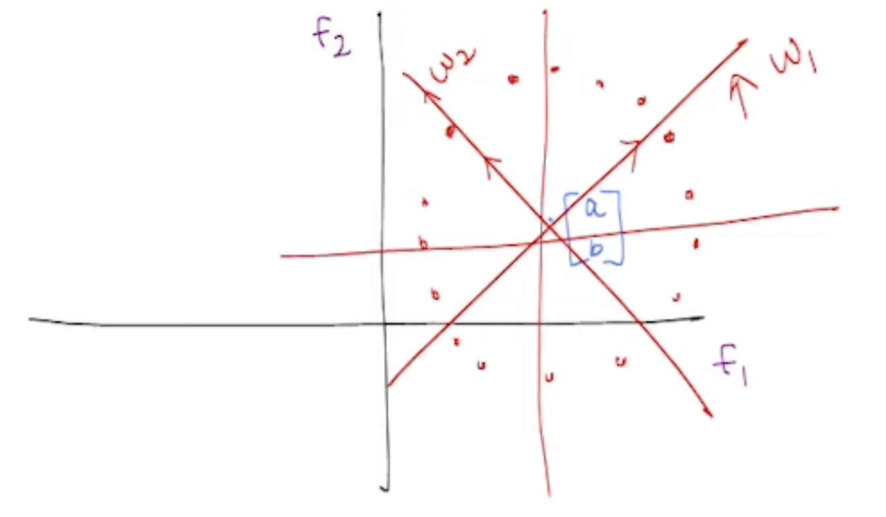
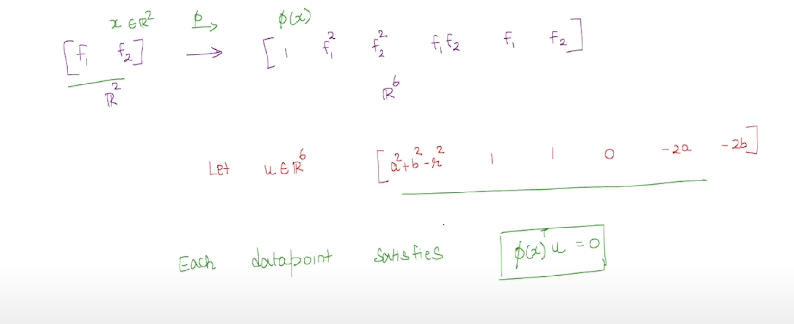

# Week - 2

# Issues/Concerns with PCA

- Time Complexity:
    - Time goes in finding eigenvector & eigenvalues.
    - For finding these for a covariance matrix (dxd), time taken ~ $O(d^3)$ ⇒ as d grows, time increases by cubic times.
    - This is an issue, when d is large.
    - E.g. in face recognition (eigen faces)
- Data may not necessarily live in a low-dimensional Linear subspace.
    - PCA just tries to find linear combination between features (variables),
    - But there are cases when the relationship between features is not linear and in fact a bit complex.

# Finding Eigenvectors

- $w_k = X\alpha_k$ ; where
- If we can find $\alpha _k$ such that the following equation exist:
    - $k\alpha_k = (n\lambda_k)\alpha_k$
    - Then the above eqn would be the Eigen Equation.
- The $\alpha_k$ should satisfy the following eqn only then it would be eligible for the eigen eqn:
    - $\alpha_k^Tk \alpha_k = 1$

### Linear Algebra Fact: The non-zero eigenvalues of $XX^T and \ X^TX$ are exactly the same.

## Steps to Solve the first problem: Computation Cost

In above picture, 

$$
\beta_k : Eigenvector \\
n\lambda_k: Eigenvalue\\
w_k: kth \ Principle \ component \ of \ the \ dataset\\
n: number \ of \ data \ points
$$

# Feature Transformation

- The second problem was that what if the data is not linear.
- For e.g., consider the following type of relationship between the datapoints, where they are kind of aligned in a circle:

## **PCA Limitations with Non linear Distributions** **(for e.g., Circular)**

### Key Concept

- When data points are distributed in a circular pattern, the information is spread evenly in all directions rather than concentrated along specific linear dimensions.

### Technical Limitation

- No single principal component can capture most of the variance because the information is not scattered linearly but is distributed around a circle.
- Regardless of how many principal components are used, PCA will not effectively reduce dimensionality for circularly distributed data since no direction contains significantly more information than others.

The points in the circle satisfy the following relationship:

- $f_1^2 + a^2 - 2f_1a+f_2^2+b^2-2f_2b-r^2=0$ ; where (a,b) center of the circle, and r is radius, f1, f2 are the axes.

## Solution

Let’s consider a function $\phi(x)$ that maps the 2-D dataset to a 6-D dataset like this:

### Formula to calculate how much dimensions are needed to map a low-dimensional non-linear data such that it becomes a low-dimensional linear subspace after mapping:

$new \ dimension\ = C_r^{n}  = n!/r!(n-r)!$ 

; where n= N+D and r = D, where N is the number of input features, and D is the final degree relationship we want to establish.

# Kernel Functions

- Any function $k: R^d*R^d \to R$ which is a valid map called kernel function.
- Valid in the above context means that there exists a $\phi(x)$ for which the dot product is to be calculated. e.g.,
    - when we need to calculate dot product of $\phi(x)^T\phi(x)$
    - then we will use a kernel function
- Formula:
    - $k(x, x') = (x^Tx'+1)^p$ ;Polynomial Kernel of power p
    - $k(x, x') = exp(-||x-x'||^2/2\sigma^2)$ ; Radial basis / Gaussian Kernel
- Use Radial Basis Function when:
    - You **don’t know** the structure of the data or the degree of the decision boundary.
    - You expect a **non-linear** and **smooth** decision boundary.
    - Your features are **continuous** and the relationships are complex.
    - You want a **universal kernel** that can model almost any function (given enough data).
- Intuition:
    - RBF maps data to an **infinite-dimensional** space.
    - It’s very flexible and can fit complex boundaries.
    - Controlled by hyperparameter σ\sigmaσ (or γ\gammaγ): smaller σ\sigmaσ means more complexity.

## How to say a kernel is a valid kernel?

Method1 - To actually execute the $\phi$ explicitly ⇒ hard, not doable in some cases

Method2 - Mercer’s Theorem

### Mercer’s Theorem

- $k: R^d*R^d \to R$ is a valid kernel, if and only if:
    - k is symmetric, i.e.,
        - k(x, x’) = k(x’, x)
        - ; why? because dot-product by nature is a symmetric operation
    - For any dataset $\{x_1, ......., x_n\}$, the matrix $K \in R^{n*n}$; where $K_{ij} = k(x_i, x_j)$ is positive sem-definite.
    - Means, all e.values of K should be non-negative (either positive or 0).
    - Why? because we know that we’re dealing with dataset in a scaled version, and when dataset is scaled version, eigenvalue are calculated as a variance of the data point form the origin in that particular eigenvector direction, hence they are always positive.