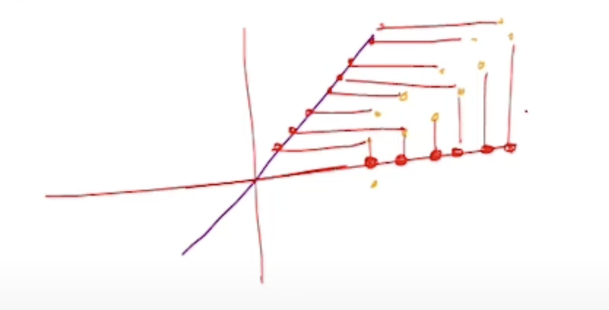

# Week - 1

## Types of Learning Algorithms

- Supervised Learning
    - Classification
        - It has finite labels.
        - Binary, Multiclass, Ordinal
        - Ordinal - classifying and then showing results in right order (e.g. in recommender system)
    - Regression
        - It has continuous labels.
    - Ranking
    - Structure Learning
- Unsupervised learning
    - Clustering
    - Representation Learning
- Sequential Learning
    - You update your model based on feedback from previous responses
    - Types:
        - Online Learning
        - Multi-armed Bandits
        - Reinforcement Learning

## Unsupervised Learning

### Representation Learning

- Goal: Given a set of “data points”, “understand”. Something “useful” about them.
- As the George Chaitin says, “Comprehension is Compression”. (Compression means compressing the whole understanding of a topic into valuable takeaways and points.)
- Therefore, understanding a dataset  is just giving some “compressed” representation of the dataset.
- When we cannot compress data points, and in fact, by doing exact reconstruction method, the no. of data points are increasing instead of decreasing, then we’ll try to find the proxy for the data point that is not falling in the line within the line itself.

**Finding Compressed Representations**

- Goal: Develop a way to find a “compressed” representation of data when datapoints not-necessarily fall on line.
    - Soln - When data points are scattered in uneven manner:
        - Draw a line (which kind of passes through them).
        - Get the projections of those data points across that line.
        - Find the compressed representation of the projected data points.
- Reconstruction Error - One line can be better than other line while drawing different lines to project those data points because of the difference in **reconstruction error**.
- Goal: Find the line that has the least reconstruction error
- Formula for Reconstruction Error:
    - For finding Error (Line, Dataset), where Line will be denoted as w (one of the lines from a unit circle; length = 1), and dataset is the given data points.
    - So we’ll calculate and minimize the following loss function:
        - f(w) = $1/n \sum_{i=1}^n ||x_i-(x_i^Tw).w||^2$
        - $((x^Tw)/ ||w||^2)w$ (assuming $||w|| \neq 1$) is the projecton of point x onto a line, where w is the vector representing this line.
- Minimizing Reconstruction Error $\equiv$ Maximizing **w** wrt to Co-variance matrix of the data.
    - Soln: w is the eigenvector corresponding to the maximum eigenvalue of C
    - For a dataset of n points in $R^d$, the dimension of its covariance matrix: d x d
- If data points are scattered across a plane, then the error vectors might also contain some information.
    - Possible Algorithms:
    - Input: $\{x_1, x_2, ...., x_n\}; x_i \in R^d$
    - Find “best” line $w_i \in R^d$
    - Replace $x_i \to x_i - (x_i^Tw)w$
    - Repeat this process to obtain multiple lines

- **Problem**: In the above approach the problem is, it is possible that our data is not centred along the origin, and finding its projection on a line which is along the origin can lead to large errors. (see image)

- **Solution**: To encounter this, we’ll first centre our data around the origin.
    - How to do centring?
        - Take the mean of the dataset, say u.
        - Subtract this mean from all data points of the dataset.
        - The new dataset obtained will be centred around the origin.

## Principal Component Analysis (PCA)

- From earlier observations we can conclude two things:
    - All residues are orthogonal to w1.
    - Any line which minimizes sum of errors w.r.t residues must also be orthogonal to w1. Why?:
        - Because residues are already orthogonal to w1.
        - Now, we want the next “best fit” line w2 to be orthogonal to w1 so it captures new info.
- Keep finding these new best fit lines which are orthogonal to all the previous lines, such that you obtain residue of the residue of the residue and so on…., until the residue tends to 0.
- {w1, w2, w3,……., wd} - The set of these vectors are mutually perpendicular and are of length 1, hence, they are called **Orthonormal Vectors**.
- Say, we run two rounds of this procedure:
    - Then residues after Round 2:
        
        $(x_i - (x_i^Tw_1)w_1) - ((x_i - (x_i^T1_1)w_1)^Tw_2)w_2$
        
    - Residues after d-rounds

### What does PCA do? (Intuitively)

- PCA finds the line that best fits the data. Such that we can even plot 4-dimension and beyond data usinng a 2D plot.
- For this, it is necessary to have a line that properly fits the data for us to display a data (4D & beyond) accurately over 2D plot.
- PCA finds the best fit line by either of the two approaches:
    - By finding the line that minimizes the error i.e., the distance from the actual data point to projected data point, OR
    - By finding the line that maximizes the distance of the projected data points from the origin.
- Fun fact is, it’s actually easier to find the best fitting line by maximizing the distance of projected points from the origin.
- Hence, PCA finds the best fit line by maximizing the sum of sqaured distances from the projected points to the origin.
    - We square the distances so that negative distances (from the -ve part of the plot) doesn’t cancel out positive distances (from the + ve part of the plot).

### Finding PC1

- PCA finally finds the best line by repeating the above step until it finds the largest quantity for sum of squared distances from projected points to origin.
- When it finds this best fit line it is called PC1.
- After this, you basically find slope of this line along the X axis, for e.g. if slope of line is 0.25, means:
    - You need to take 4 parts of var1 (x-axis) and 1 part of var2 (y-axis) to form this best fit line.
    - In practice, we call it like, “PC1 is a linear combination of two vars…”
    - Use pythagorean theorem to find the length of this line from the origin. Let’s say it comes 4.12.
    - Now, in practice, we aim to scale this value down to 1 unit, which means we’ll need to divide all 3 sides of this right angle triangle by 4.12 to make the length of this best fit line turn 1 unit.
    - By doing so, the length of other parts scale down to 0.97 (x-part) and 0.242 (y-part).
    - Now, the 1 unit vector, consisting the 0.97 parts of var1 and 0.242 parts of var2, is called **Singular Vector** or **Eigenvector** for PC1.
    - Here the proportion of each variable used to make the eigenvector are called “**Loading Scores**”.

**Eigenvalue**: PCA calls the avg of SS(distances) for the best fit line the Eigenvalue for PC1.

**Singular Value**: Square root of the SS(distances) for PC1 is called Singular Value for PC1.

Also, 

Eigenvector * Covariance Matrix = Eigenvalue * Eigenvector

$Cw_k = \lambda_kw_k$

### Finding PC2

Since, we’re in a 2D plane, PC2 would be just the line perpendicular to PC1.

And we can similarly find Eigenvector, eigenvalue, singular value, and loading score for PC2 similar to how we did for PC1.

### Finding PC3 and Beyond

We can find PC3 similarly in cases when we have let say 3D data (data with 3 vars).

- We can keep finding more PC as the number of vars increases.
- But, in practice, the number of PCs is either no. of vars or the no. of samples, whichever is smaller.

Once, we’re done finding all PCs, we’ll look out their eigenvalues to and find the proportion each PC is contributing to in the whole dataset.

For this, we can draw a scree plot with the percentage value of proportion contributed by each PC to the data. Which basically signifies the where the most variations is happening inside the data.

Usually, in 3D and beyond data, we keep only the PCs that are cumulatively contributing ~95% variations in the dataset, and forget about the rest of the dataset. And just draw a 2D plot with the PCs we have kept.

### Practical Tips

- Scale the data so that all variables are on the same scale or are roughly equivalent, to avoid bias towards one variable.
    - In practice, for scaling the data, we should basically divide each variable with its standard deviation.
- Before finding PCs, center the data around origin, as PCA always try to find the best fit line that passes through the origin, and not having the data around the origin will result in wrong PCs.

Since, in PCA we’re basically going from a much much larger dimension to smaller dimension, PCA is also considered a Dimensionality Reduction Technique.